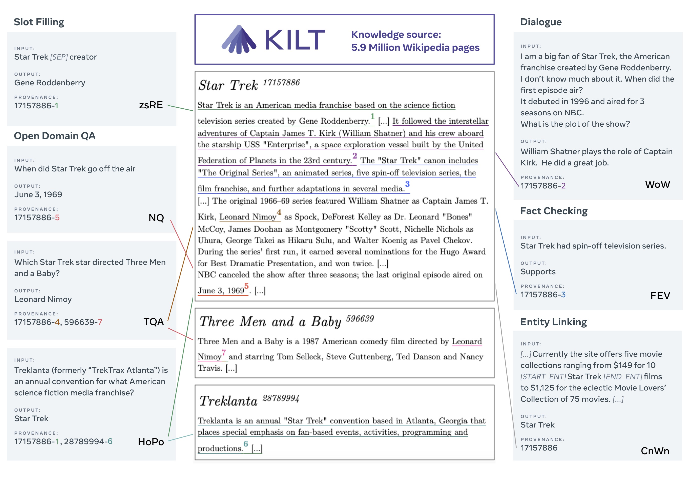

--------------------------------------------------------------------------------

# A Benchmark for Knowledge Intensive Language Tasks

[http://kiltbenchmark.com/](http://kiltbenchmark.com)


The KILT benchmark is described in the following paper:

```bibtex
@inproceedings{petroni-etal-2021-kilt,
    title = "{KILT}: a Benchmark for Knowledge Intensive Language Tasks",
    author = {Petroni, Fabio  and Piktus, Aleksandra  and
      Fan, Angela  and Lewis, Patrick  and
      Yazdani, Majid  and De Cao, Nicola  and
      Thorne, James  and Jernite, Yacine  and
      Karpukhin, Vladimir  and Maillard, Jean  and
      Plachouras, Vassilis  and Rockt{\"a}schel, Tim  and
      Riedel, Sebastian},
    booktitle = "Proceedings of the 2021 Conference of the North American Chapter of the Association 
                 for Computational Linguistics: Human Language Technologies",
    month = jun,
    year = "2021",
    address = "Online",
    publisher = "Association for Computational Linguistics",
    url = "https://aclanthology.org/2021.naacl-main.200",
    doi = "10.18653/v1/2021.naacl-main.200",
    pages = "2523--2544",
}
```

[https://arxiv.org/abs/2009.02252](https://arxiv.org/abs/2009.02252)


## Setup the env

```bash
conda create -n kilt37 -y python=3.7 && conda activate kilt37
pip install -e .
```

## KILT knowledge source

The KILT knowledge source can be downloaded here: [kilt_knowledgesource.json](http://dl.fbaipublicfiles.com/KILT/kilt_knowledgesource.json) (34.76GiB).<br>
It is based on the [2019/08/01 Wikipedia dump](http://dl.fbaipublicfiles.com/BLINK/enwiki-pages-articles.xml.bz2).<br>
We use [mongoDB](https://www.mongodb.com) to index the knowledge base (but you can use any json-based db).<br>
To import the knowledge source in mongoDB run:

```bash
wget http://dl.fbaipublicfiles.com/KILT/kilt_knowledgesource.json
mongoimport --db kilt --collection knowledgesource --file kilt_knowledgesource.json
```


### Structure of each record

```python
{
 'wikipedia_title': 'Email marketing',
 'wikipedia_id': 1101759, 
 'text': ['p1', 'p2',...., 'pn'], # list of paragraph text
 'anchors': [{"text":,"href":,"paragraph_id":,"start":,"end":} ]  , 
 'categories': 'comma separated list of categories'
 'history': # some info from wikipedia, including original url
 'wikidata_info': # wikidata info
 }
```

### Query the knowledge source

```python
from kilt.knowledge_source import KnowledgeSource

# get the knowledge souce
ks = KnowledgeSource()

# count entries - 5903530
ks.get_num_pages()

# get page by id
page = ks.get_page_by_id(27097632)

# get pages by title
page = ks.get_page_by_title("Michael Jordan")
```


## KILT data

Examples:


### download the data

```bash
mkdir data
python scripts/download_all_kilt_data.py
python scripts/get_triviaqa_input.py
```

You can also download and use the KILT data through [the HuggingFace's nlp library](https://huggingface.co/datasets?search=kilt).

Note that we release only the input for the test sets, without answers.
Test answers are used for [the KILT challenge on EvalAI](https://evalai.cloudcv.org/web/challenges/challenge-page/689/overview) where participants can upload their models’ predictions and be listed on the public leaderboard (there are strict submission limits to discourage overfitting on test data).

### KILT data format

```python
{'id': # original data point id if available otherwise unique id
 'input': # question / claim / sentence / etc
 'output': [ # each element might contain an answer, a provenance or both
    {
    'answer': # answer in textual form
    'provenance': [
        # evidence set for the answer from the KILT ks
        {
            'wikipedia_id':  # *mandatory* 
            'title': 
            'section': 
            'start_paragraph_id': 
            'start_character': 
            'end_paragraph_id':
            'end_character': 
            'bleu_score': # wrt original evidence
            'meta': # dataset/task specific
        }
        ] 
      }
    ]
 'meta': # dataset/task specific
 }
```

### KILT data catalogue

| dataset | task | train | dev | test |
| ------------- | ------------- | ------------- | ------------- | ------------- | 
| [FEVER](https://fever.ai) | Fact Checking | [fever-train-kilt.jsonl](http://dl.fbaipublicfiles.com/KILT/fever-train-kilt.jsonl)<br>(104,966 lines, 38.9MiB)  | [fever-dev-kilt.jsonl](http://dl.fbaipublicfiles.com/KILT/fever-dev-kilt.jsonl)<br>(10,444 lines, 6.17MiB) | [fever-test_without_answers-kilt.jsonl](http://dl.fbaipublicfiles.com/KILT/fever-test_without_answers-kilt.jsonl)<br>(10,100 lines, 839kiB) | 
| [AIDA CoNLL-YAGO](https://www.mpi-inf.mpg.de/departments/databases-and-information-systems/research/ambiverse-nlu/aida/downloads) | Entity Linking | [aidayago2-train-kilt.jsonl](http://dl.fbaipublicfiles.com/KILT/aidayago2-train-kilt.jsonl)<br>(18,395 lines, 70.1MiB) | [aidayago2-dev-kilt.jsonl]( http://dl.fbaipublicfiles.com/KILT/aidayago2-dev-kilt.jsonl)<br>(4,784 lines, 21.1MiB) | [aidayago2-test_without_answers-kilt.jsonl](http://dl.fbaipublicfiles.com/KILT/aidayago2-test_without_answers-kilt.jsonl)<br>(4,463 lines, 14.4MiB) | 
| [WNED-WIKI](https://github.com/U-Alberta/wned) | Entity Linking | - | [wned-dev-kilt.jsonl](http://dl.fbaipublicfiles.com/KILT/wned-dev-kilt.jsonl)<br>(3,396 lines, 12.9MiB) | [wned-test_without_answers-kilt.jsonl](http://dl.fbaipublicfiles.com/KILT/wned-test_without_answers-kilt.jsonl)<br>(3,376 lines, 13.3MiB) | 
| [WNED-CWEB](https://github.com/U-Alberta/wned) | Entity Linking | - | [cweb-dev-kilt.jsonl](http://dl.fbaipublicfiles.com/KILT/cweb-dev-kilt.jsonl)<br>(5,599 lines, 90.2MiB)  | [cweb-test_without_answers-kilt.jsonl](http://dl.fbaipublicfiles.com/KILT/cweb-test_without_answers-kilt.jsonl)<br>(5,543 lines, 100MiB) | 
| [T-REx](https://hadyelsahar.github.io/t-rex) | Slot Filling | [trex-train-kilt.jsonl](http://dl.fbaipublicfiles.com/KILT/trex-train-kilt.jsonl)<br>(2,284,168 lines, 1.75GiB) | [trex-dev-kilt.jsonl](http://dl.fbaipublicfiles.com/KILT/trex-dev-kilt.jsonl)<br>(5,000 lines, 3.80MiB) | [trex-test_without_answers-kilt.jsonl](http://dl.fbaipublicfiles.com/KILT/trex-test_without_answers-kilt.jsonl)<br>(5,000 lines, 896kiB) | 
| [Zero-Shot RE](http://nlp.cs.washington.edu/zeroshot) | Slot Filling | [structured_zeroshot-train-kilt.jsonl](http://dl.fbaipublicfiles.com/KILT/structured_zeroshot-train-kilt.jsonl)<br>(147,909 lines, 71.4MiB) | [structured_zeroshot-dev-kilt.jsonl](http://dl.fbaipublicfiles.com/KILT/structured_zeroshot-dev-kilt.jsonl)<br>(3,724 lines, 2.27MiB) | [structured_zeroshot-test_without_answers-kilt.jsonl](http://dl.fbaipublicfiles.com/KILT/structured_zeroshot-test_without_answers-kilt.jsonl)<br>(4,966 lines, 1.22MiB) |
| [Natural Questions](https://ai.google.com/research/NaturalQuestions) | Open Domain QA | [nq-train-kilt.jsonl](http://dl.fbaipublicfiles.com/KILT/nq-train-kilt.jsonl)<br>(87,372 lines, 51.9MiB) | [nq-dev-kilt.jsonl](http://dl.fbaipublicfiles.com/KILT/nq-dev-kilt.jsonl)<br>(2,837 lines, 7.94MiB) | [nq-test_without_answers-kilt.jsonl](http://dl.fbaipublicfiles.com/KILT/nq-test_without_answers-kilt.jsonl)<br>(1,444 lines, 334kiB) | 
| [HotpotQA](https://hotpotqa.github.io) | Open Domain QA | [hotpotqa-train-kilt.jsonl](http://dl.fbaipublicfiles.com/KILT/hotpotqa-train-kilt.jsonl)<br>(88,869 lines, 52.8MiB) | [hotpotqa-dev-kilt.jsonl](http://dl.fbaipublicfiles.com/KILT/hotpotqa-dev-kilt.jsonl)<br>(5,600 lines, 3.97MiB) | [hotpotqa-test_without_answers-kilt.jsonl](http://dl.fbaipublicfiles.com/KILT/hotpotqa-test_without_answers-kilt.jsonl)<br>(5,569 lines, 778kiB) |
| [TriviaQA](http://nlp.cs.washington.edu/triviaqa) | Open Domain QA | [triviaqa-train_id-kilt.jsonl](http://dl.fbaipublicfiles.com/KILT/triviaqa-train_id-kilt.jsonl)<sup>*</sup><br>(61,844 lines, 102MiB) | [triviaqa-dev_id-kilt.jsonl](http://dl.fbaipublicfiles.com/KILT/triviaqa-dev_id-kilt.jsonl)<sup>*</sup><br>(5,359 lines, 9.81MiB) | [triviaqa-test_id_without_answers-kilt.jsonl](http://dl.fbaipublicfiles.com/KILT/triviaqa-test_id_without_answers-kilt.jsonl)<sup>*</sup><br>(6,586 lines, 123kiB) |
| [ELI5](https://facebookresearch.github.io/ELI5/explore.html) | Open Domain QA | [eli5-train-kilt.jsonl](http://dl.fbaipublicfiles.com/KILT/eli5-train-kilt.jsonl)<br>(272,634 lines, 548MiB) | [eli5-dev-kilt.jsonl](http://dl.fbaipublicfiles.com/KILT/eli5-dev-kilt.jsonl)<br>(1,507 lines, 14.1MiB) | [eli5-test_without_answers-kilt.jsonl](http://dl.fbaipublicfiles.com/KILT/eli5-test_without_answers-kilt.jsonl)<br>(600 lines, 99kiB) | 
| [Wizard of Wikipedia](https://parl.ai/projects/wizard_of_wikipedia) | Dialogue | [wow-train-kilt.jsonl](http://dl.fbaipublicfiles.com/KILT/wow-train-kilt.jsonl)<br>(63,734 lines, 48.9MiB) | [wow-dev-kilt.jsonl](http://dl.fbaipublicfiles.com/KILT/wow-dev-kilt.jsonl)<br>(3,054 lines, 2.42MiB) | [wow-test_without_answers-kilt.jsonl](http://dl.fbaipublicfiles.com/KILT/wow-test_without_answers-kilt.jsonl)<br>(2,944 lines, 1.29MiB)|
 
<sup>*</sup> run `python scripts/get_triviaqa_input.py` to get the question associated with each id

### Additional data

For Entity Linking, in addition to the AIDA CoNLL-YAGO train set, the whole knowledge source can be used as training data by exploiting hyperlinks. To facilitate experimentation, we release such data in KILT format following the splits of [BLINK](https://github.com/facebookresearch/BLINK):
- [blink-train-kilt.jsonl](http://dl.fbaipublicfiles.com/KILT/blink-train-kilt.jsonl) (9M lines)
- [blink-dev-kilt.jsonl](http://dl.fbaipublicfiles.com/KILT/blink-dev-kilt.jsonl) (10,000 lines)

We also provide a [script](scripts/map_TAC-KBP2010_to_KILT.py) to map the TAC-KBP 2010 dataset to the knowledge source and format of KILT.

## Run the retrieval evaluation

Please follow [this README](kilt/retrievers/README.md).


## Mapping scripts

Mapping scripts are located in `kilt/datasets/`.
See `scripts/map_datasets.py` for an example.


## Troubleshooting

If the module cannot be found, preface the python command with `PYTHONPATH=.`

If the experiments fail on GPU memory allocation, try reducing batch size.


## License
KILT is MIT licensed. See the [LICENSE](LICENSE) file for details.
